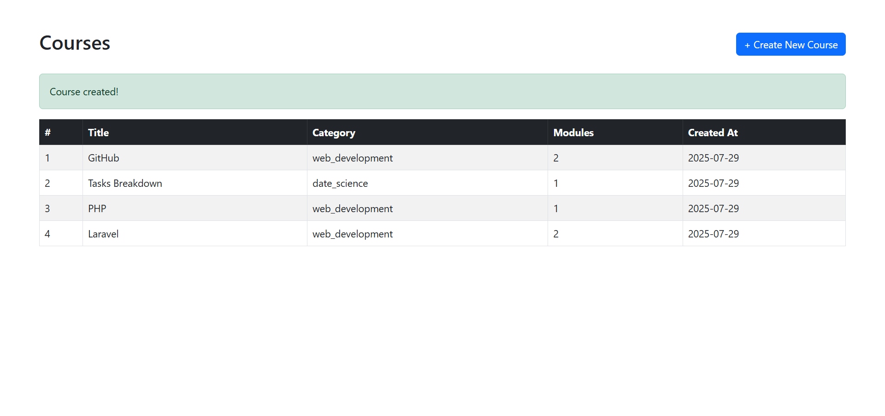
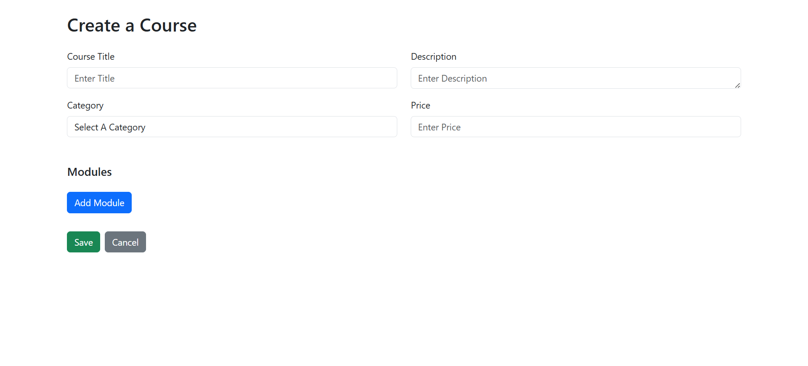
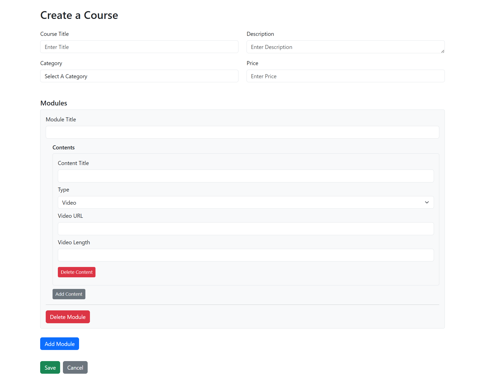
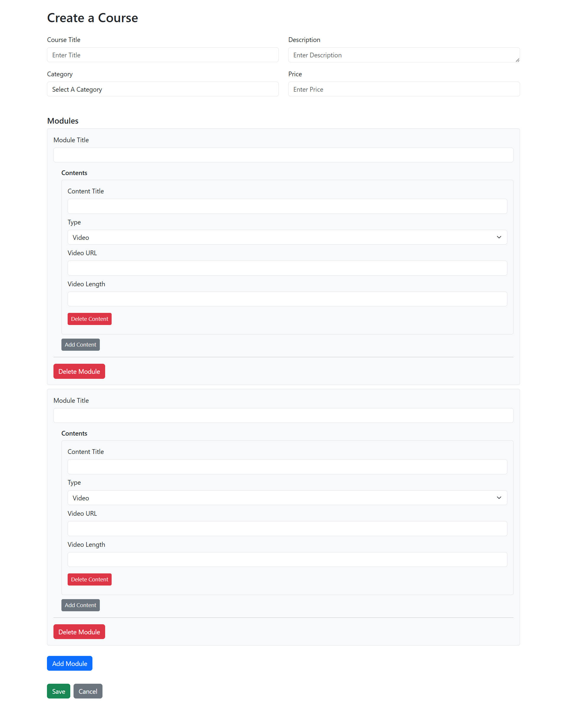

All Code Is Available In The Main Branch.

## Requirements

- PHP ≥ 8.2  
- Composer ≥ 2.x  
- Node.js & npm  
- MySQL or other supported DB

---

## Installation Steps

**1. Clone the repository**
git clone https://github.com/shafiqul-iislam/course_creation_app.git
cd course_creation_app

**2. Install backend dependencies**
composer install

**3. Copy .env and set up your database**
cp .env.example .env
php artisan key:generate

**4. Configure .env with DB credentials**
**DB_DATABASE=course_creation_app**
**DB_USERNAME=**
**DB_PASSWORD=**

**5. Run migrations**
php artisan migrate

**7. Install frontend dependencies**
npm install && npm run dev

**8. Start the local server**
php artisan serve

## 📸 Screenshots

### 🖥️ courses list

### 📘 Course Creation - 1

### 📘 Course Creation - 2

### 📘 Course Creation - 3
